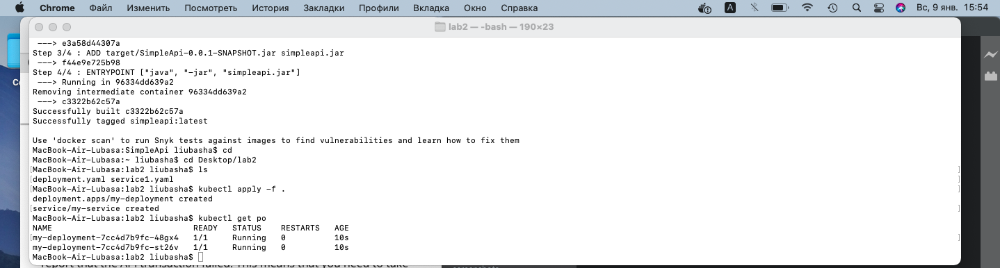
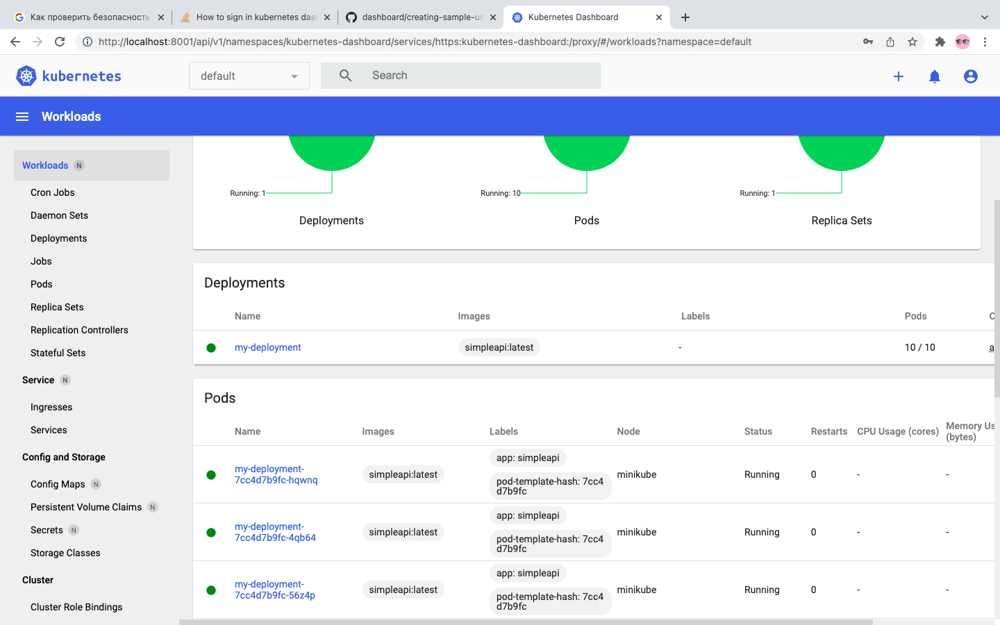

# Отчет по Лабораторной работе №2: создание кластера Kubernetes и деплой приложения. 

Дисциплина: Технологии разработки программного обеспечения.

Выполнил: студентка гр.МБД2131 Харлиева Л.Ц.

Целью лабораторной работы является знакомство с кластерной архитектурой на примере Kubernetes, а также деплоем приложения в кластер.

## Отчет:

1. Манифест deployment.yaml :
````
apiVersion: apps/v1
kind: Deployment
metadata:
  name: my-deployment
spec:
  replicas: 2
  selector:
    matchLabels:
      app: simpleapi
  strategy:
    type: RollingUpdate
    rollingUpdate:
      maxSurge: 1
      maxUnavailable: 1 
  template:
    metadata:
      labels:
        app: simpleapi
    spec:
       containers:
        - image: simpleapi:latest
          imagePullPolicy: Never 
          name: simpleapi
          ports:
          - containerPort: 8080
       hostAliases:
        - ip: "192.168.65.2" # The IP of localhost from MiniKube
          hostnames:
            - postgres.local
````

2. Манифест dservice.yaml:
````

apiVersion: v1
kind: Service
metadata:
  name: my-service
spec:
  type: NodePort
  selector: 
    app: simpleapi
  ports:
    - port: 8080
      targetPort: 8080
      nodePort: 31317
  
````

3. Скриншт вывода команды консоли с шага 3.3 на фоне рабочего стола: 
 


4.Скриншоты графического интерфейса с шага 3.5, где видны поды:
 

5.Видео с обзором созданного кластера:
 
